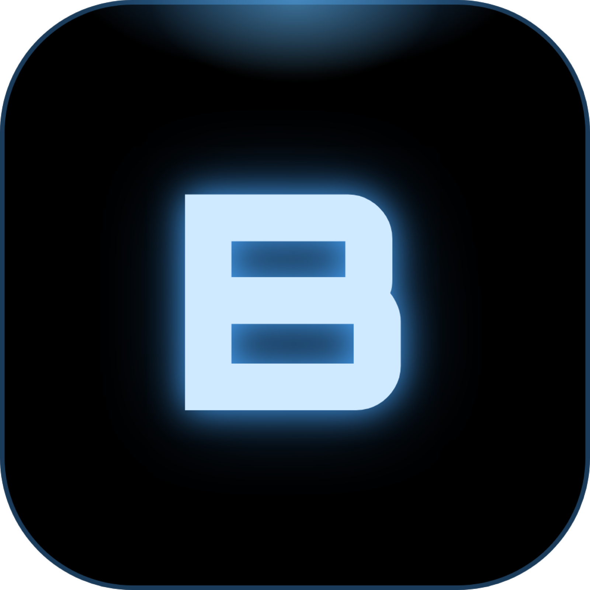

<p align="center">
  
</p>

<h1 align="center">Bridge</h1>

<p align="center">
  A dark/light desktop client for <b>Claude Code</b>.<br>
  It reads <code>~/.claude</code> directly and drives the real <code>claude</code> CLI, so your hooks,
  skills, agents and sessions stay exactly where they are.
</p>

<p align="center">
  <a href="https://mrmading.github.io/bridge/">Landing page</a> ·
  <a href="https://github.com/mrmading/bridge/releases/latest">Download</a> ·
  <a href="#how-it-works">How it works</a> ·
  <a href="#safety">Safety</a> ·
  <a href="LICENSE">MIT</a>
</p>

---

Claude Code is excellent and its terminal UI is a terminal UI. Bridge keeps the engine and changes
the surface: a chat window with tabs, a full-text search over every transcript on the machine, an
editor for your `CLAUDE.md` and memory files, and a live activity log.

It is **not** a reimplementation. Every turn spawns the real CLI with `--session-id` / `--resume`,
so a conversation started in Bridge is an ordinary Claude Code session you can pick up in the
terminal with `claude --resume`, and vice versa.

## Download

**[Bridge-0.1.0.dmg](https://github.com/mrmading/bridge/releases/latest)** — drag it into
Applications and open it. On first run Bridge checks for the two free tools it needs, offers to
install whichever is missing, and asks whether you use LifeOS. Nothing is installed unless you press
the button.

> **First launch, once only.** This build is not notarised yet, so macOS will refuse it the first
> time. Open it anyway, then go to **System Settings → Privacy & Security**, scroll to the bottom
> and press **Open Anyway** next to Bridge. (On macOS 14 and earlier, right-click → **Open** →
> **Open** is enough.) Builds made with a Developer ID certificate are signed, notarised and
> stapled automatically, and skip all of this: see [mac/SIGNING.md](mac/SIGNING.md).

## Install from source

Bridge needs [Bun](https://bun.sh) and the [`claude` CLI](https://claude.com/claude-code) on your
`PATH` — or let the app's setup screen install them for you.

```bash
git clone https://github.com/mrmading/bridge.git
cd bridge
./bridge                 # starts the server and opens http://localhost:4270
```

### Building the app yourself

```bash
./mac/build.sh           # → dist/Bridge.app
./mac/dmg.sh             # → dist/Bridge-<version>.dmg
```

A small Swift shell around a `WKWebView`: it starts the bundled server on a free port, waits for it,
and shows it in a real window with a real menu bar. No Electron, no Chromium, no `node_modules`.
Building needs the Xcode Command Line Tools (`xcode-select --install`). The app keeps its state in
`~/Library/Application Support/Bridge`.

## What you get

**Chat, not a terminal log.** Streaming text, thinking folded behind a one-line summary, and every
tool call as a collapsible card: Bash shows command and output, `Edit` renders a real ± diff,
`Write` shows what was written, `TodoWrite` renders the checklist. Sub-agent output gets its own
gutter.

**Sessions are tabs.** Several open at once, each with its own transcript, token counters, cost and
working directory. A tab that is working shows a flashing green dot. `⌄` (or `⌘P`) drops a
searchable list of recent sessions across every directory you have ever run in.

**Keep typing while it works.** `↵` during a running turn queues the message and sends it the moment
the turn finishes, the same way the terminal does. The stop button is `Ctrl+C`: SIGINT first,
SIGTERM after 1.5 s, SIGKILL after 4 s only if the process ignores both.

**`⌘F` searches every transcript on the machine.** Describe what you are after in your own words.
Bridge greps all of `~/.claude/projects` with the ripgrep that ships inside the `claude` binary,
ranks on how many of your terms a session actually covers rather than raw hit count, and shows what
you asked, how it ended, tool and file counts, and highlighted snippets. A few hundred milliseconds
over hundreds of megabytes of JSONL.

**Five places, and nothing else:**

| Rail | What's in it |
|---|---|
| Sessions | The conversation: tabs on top, composer at the bottom |
| Activity | Live summary and log — running now, turns / spend / model time today, every start, finish, failure, stop and file save, and the sessions touched today |
| Agents | Every agent definition, grouped into areas of expertise, each one readable and editable |
| Directory | The folders you added on the left, their contents on the right with size and last-edited time |
| Configs | `CLAUDE.md`, settings, memory files, skills — pills for each group, every file editable |

The top bar is identical everywhere: page title, path, and one search box whose placeholder tells
you what it searches. Opening anything gives a detail page with `← back`, not another tab strip.

**Everything is editable.** `Edit` swaps the rendered document for a monospace editor and `⌘S`
writes it to disk. Markdown gets a split view with a live preview that re-renders as you type.

**Notifications** sit in the top bar: anything that finishes or fails while you were looking
elsewhere lands there and stays, surviving a reload, and clicking it opens that session.

**An inspector** (`⌘I`) with session id, cwd, branch, model, token usage split into
input / output / thinking / cache read / cache write, a tool-call histogram, and every file the
session wrote.

**A PAI phase strip** that lights up OBSERVE → THINK → PLAN → BUILD → EXECUTE → VERIFY → LEARN, for
people running [PAI](https://github.com/danielmiessler/PAI). Harmless if you are not.

### Keyboard

`↵` send · `⇧↵` newline · `⌘K` palette · `⌘F` search everything · `⌘T` new session ·
`⌘P` session switcher · `⌘1…9` tab · `⌘W` close · `⌘S` save · `⌘I` inspector · `⌘J` theme

## How it works

`server.ts` (Bun, zero dependencies) does three things.

**1. Reads `~/.claude`, read-only.** Project directories are resolved to their real `cwd` by parsing
the transcripts rather than guessing at the dash-encoded folder name. Transcript JSONL is normalized
into a flat event list — user, assistant, thinking, tool plus result, sub-agent — with tool results
joined back onto their `tool_use_id` and usage de-duplicated by `requestId`. Session metadata is
cached by mtime and persisted, so listing hundreds of transcripts costs about 20 ms on a cold start.

**2. Spawns the real CLI** for every turn:

```
claude -p --output-format stream-json --include-partial-messages --verbose \
       --session-id <uuid> | --resume <id> \
       --permission-mode … [--model …] [--agent …] [--effort …]
```

stdout is re-emitted to the browser over SSE. The `env` block from your `settings.json` is injected
into the child so hooks behave exactly as they do in the terminal.

**3. Searches transcripts** with ripgrep, one pass per term in parallel, scoring each file on term
coverage, title and first-prompt matches, and size, then building a plain-text digest of the best
matches.

`public/` is plain HTML, CSS and one vanilla JS file. No framework, no bundler, no `node_modules`.

## Safety

Bridge does not expose your machine. Every file API is confined to the folders listed in the
Directory panel — two sensible defaults on first run, stored in `.cache/roots.json` and managed from
the UI — and inside those it still refuses anything matching `.ssh`, `.aws`, `.gnupg`,
`.credentials`, `.env*`, `*.pem` or `id_rsa`, for reads and writes alike. Anything outside says so
and offers to add the folder.

The composer defaults to `acceptEdits`; `bypassPermissions` exists but has to be chosen explicitly
per session. The server binds to localhost only and there is no auth layer, because there is nothing
to authenticate to — it is your machine talking to itself.

## Layout

```
bridge              launcher (start + open)
server.ts           API, CLI driver, transcript parser, search
public/
  index.html        shell
  style.css         design tokens, light + dark
  app.js            renderer, streaming, palette, search, editor
mac/
  Bridge/main.swift the native shell
  Bridge/Setup.swift first-run setup: Bun, Claude Code, LifeOS
  build.sh          → dist/Bridge.app
  dmg.sh            → dist/Bridge-<version>.dmg
docs/               the landing page (GitHub Pages)
```

## Contributing

See [CONTRIBUTING.md](CONTRIBUTING.md). The short version: keep it dependency-free, never widen the
file sandbox, and don't reimplement Claude Code.

## Licence

MIT. See [LICENSE](LICENSE).
